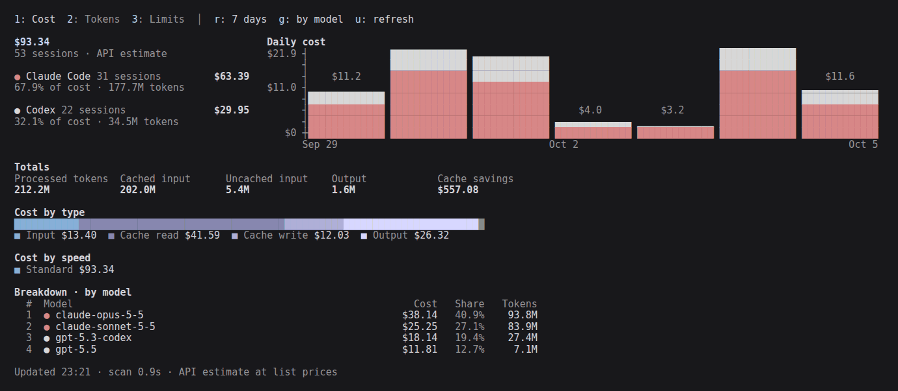
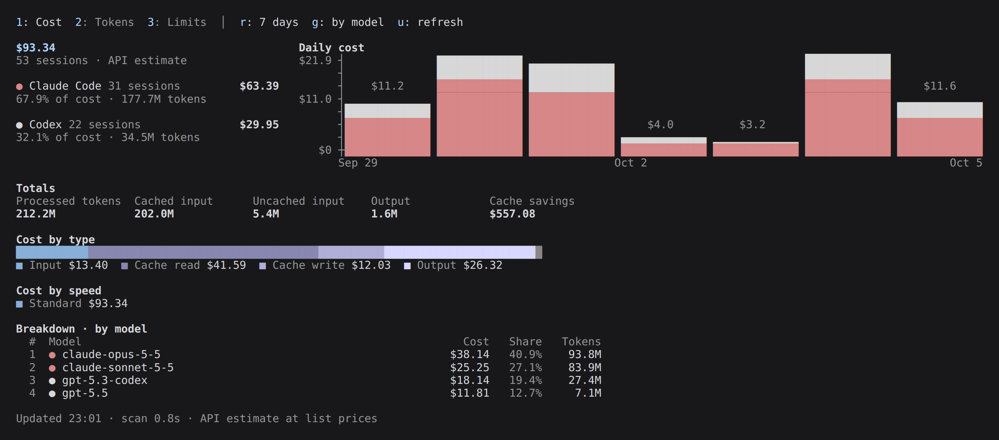
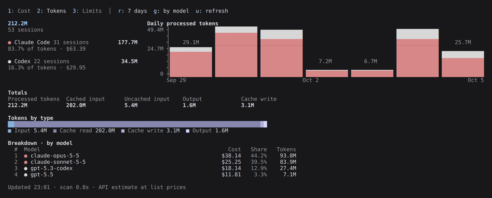
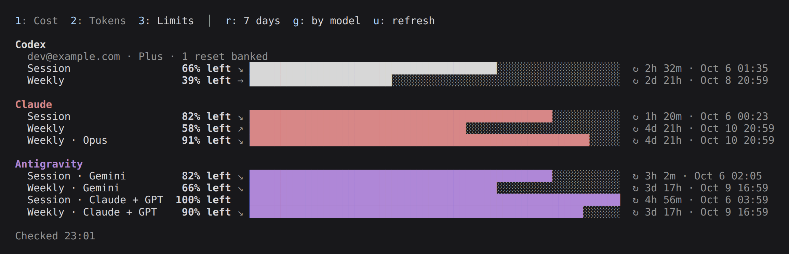
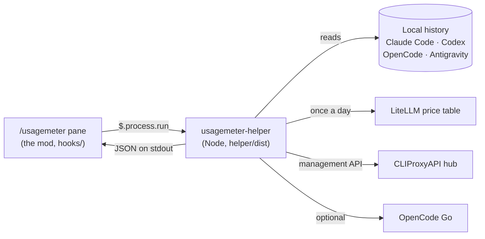

# usagemeter

[](https://github.com/Elesiann/usagemeter/actions/workflows/ci.yml)
[](LICENSE)


**Cost, tokens and plan limits of your coding agents, in one `/usagemeter`
pane inside Claude Code.**

usagemeter is a [Claude Code mod](https://code.claude.com/docs/en/plugins/mods/overview).
It reads the local history of Claude Code, Codex, OpenCode and Antigravity,
prices every response at API list prices, and draws the result next to your
conversation. With a [CLIProxyAPI](https://github.com/router-for-me/CLIProxyAPI)
hub it also shows the session and weekly limits of every account the hub
holds.

<p align="center">
  
</p>

<sub>Screenshots and the animation use generated demo data.</sub>

## Contents

- [Features](#features)
- [Requirements](#requirements)
- [Install](#install)
- [Use](#use)
- [Configure](#configure)
- [Where the numbers come from](#where-the-numbers-come-from)
- [How it works](#how-it-works)
- [Privacy](#privacy)
- [Troubleshooting](#troubleshooting)
- [Limitations](#limitations)
- [Contributing](#contributing)
- [Credits](#credits)

## Features

- **Cost and tokens** for the past 24 hours (hourly), 7, 30 or 90 days, per
  agent and per model, with a stacked daily chart.
- **Totals** of processed, cached, uncached and output tokens, cache savings,
  and cost split by token type and by speed (standard, fast).
- **Plan limits** with the time left until each reset, its local time, and a
  pace arrow that shows whether you are using a window faster (↗) or slower
  (↘) than it elapses.
- **Fast after the first scan**: parsed transcripts are cached, so a refresh
  reads only the lines written since the last one.
- **Same pane in the terminal and the Desktop app's Code tab**: the charts are
  plain text.

<p align="center">
  
</p>

<p align="center">
  
</p>

<p align="center">
  
</p>

## Requirements

| | Version | Why |
| --- | --- | --- |
| [Claude Code](https://code.claude.com) | 2.1.287 or later | Mods arrived in 2.1.287 |
| [Node.js](https://nodejs.org) on `PATH` | 22.5 or later | The helper reads OpenCode and Antigravity history with `node:sqlite` |
| [CLIProxyAPI](https://github.com/router-for-me/CLIProxyAPI) | Optional | Limits for the Codex, Claude and Antigravity accounts it holds |
| OpenCode Go plan | Optional | OpenCode Go limits |

usagemeter draws in the Claude Code terminal (including an editor's integrated
terminal) and in the Code tab of the Desktop app. The VS Code extension's chat
panel, `claude -p`, and Desktop sessions running inside WSL do not draw mods.

It is developed and tested on Linux and WSL 2. macOS should work the same way;
Windows outside WSL is untested.

## Install

```bash
claude plugin marketplace add Elesiann/usagemeter
claude plugin install usagemeter@usagemeter
```

Then run `/reload-plugins` in a running session (or start a new one) and open
the pane:

```text
/usagemeter
```

The first open scans up to 90 days of history. That takes from a few seconds
to about a minute on several gigabytes of transcripts; later opens show the
last snapshot at once and refresh in the background.

To try a checkout without installing it:

```bash
git clone https://github.com/Elesiann/usagemeter
claude --plugin-dir ./usagemeter
```

## Use

| Key | Does |
| --- | --- |
| `1` `2` `3` | Cost, Tokens, Limits |
| `r` | Cycle the range: past 24 hours, 7, 30, 90 days |
| `g` | Group the breakdown by model, by agent, or by day |
| `u` | Refresh now |
| `Esc` | Close the pane |

`/usagemeter refresh` opens the pane and rescans at once.

The keys work while the pane has keyboard focus. It takes focus when you open
it from an empty prompt; press Ctrl+X then Tab to focus it later. In a
terminal narrower than about 144 columns the pane opens above the prompt;
otherwise it docks beside the conversation, and Ctrl+X then ← or → resizes it.

## Configure

Plan limits need a CLIProxyAPI hub. Set its address and management key with:

```text
/plugin configure usagemeter@usagemeter
```

| Option | Default | |
| --- | --- | --- |
| `hubUrl` | `http://localhost:8317` | Base URL of your CLIProxyAPI instance |
| `hubKey` | empty | Management key. Kept in Claude Code's secure storage; empty skips the hub |
| `openCodeGo` | `false` | Read OpenCode Go limits with OpenCode's own key |

From a shell, pipe the values instead, which keeps the key out of your shell
history:

```bash
read -rs KEY && printf '{"hubKey":"%s"}' "$KEY" | claude plugin configure usagemeter@usagemeter --values-stdin; unset KEY
```

Restart Claude Code after changing options.

### Environment variables

usagemeter finds history where each agent keeps it, and honors the same
variables the agents do:

| Variable | Effect |
| --- | --- |
| `CLAUDE_CONFIG_DIR` | Claude Code's directory (default `~/.claude`) |
| `CODEX_HOME` | An extra Codex home, read alongside `~/.codex` |
| `OPENCODE_DATA_DIR`, `XDG_DATA_HOME` | OpenCode's data directory (default `~/.local/share/opencode`) |
| `ANTIGRAVITY_DATA_DIR` | Antigravity's conversation directories |
| `USAGEMETER_HOME` | Read all history from another home, for example `/mnt/c/Users/you` from WSL |
| `USAGEMETER_CACHE_DIR` | Where the scan and price caches live (default `~/.cache/usagemeter`) |

`CODEX_HOME`, `OPENCODE_DATA_DIR` and `ANTIGRAVITY_DATA_DIR` accept
comma-separated lists.

## Where the numbers come from

| Agent | Cost and tokens | Limits |
| --- | --- | --- |
| Claude Code | `~/.claude/projects/**/*.jsonl` | Each Claude account in the hub (session, weekly, weekly per model), or else this session's own windows |
| Codex | `~/.codex/sessions/**/*.jsonl` | Each Codex account in the hub (session, weekly, banked reset credits) |
| OpenCode | OpenCode's SQLite database | OpenCode Go (session, weekly, monthly) when `openCodeGo` is on |
| Antigravity | Antigravity's conversation databases | Each Antigravity account in the hub (session and weekly, for Gemini and for Claude + GPT) |

**Cost is an estimate at API list prices** from
[LiteLLM's public price table](https://github.com/BerriAI/litellm/blob/main/model_prices_and_context_window.json),
refreshed once a day. It is what the same usage would cost through the API,
not what a subscription bills you. Models missing from the table show as
`Unpriced`.

## How it works



- The **mod** (`hooks/`) keeps the pane's state, draws it, and saves the last
  snapshot so the pane opens at once.
- The **helper** (`helper/dist/usagemeter-helper.mjs`) does the heavy part in
  its own process: `scan` reads and prices history and prints all four ranges
  as JSON; `limits` asks the hub and OpenCode Go for plan limits.
- Transcript parsing, deduplication across resumed sessions, the incremental
  cache and pricing come from [T3 Code](https://github.com/pingdotgg/t3code),
  vendored under `helper/src/t3/` with its MIT license.

## Privacy

- Transcripts are read locally and never leave your machine. The cache holds
  token counts, not message content.
- The helper makes three kinds of requests: the LiteLLM price table, your
  hub's management API, and OpenCode's usage endpoint when `openCodeGo` is on.
- The hub key lives in Claude Code's secure storage and reaches the helper
  through its environment, never its command line, a file, or the pane.
- Responses from the hub or providers are never shown as they came.

See [SECURITY.md](SECURITY.md) for details and how to report a vulnerability.

## Troubleshooting

| You see | Do this |
| --- | --- |
| `usagemeter needs Node.js 22.5 or later on PATH` | Install Node.js 22.5+ and check that `node --version` works in the shell that starts Claude Code |
| `CLIProxyAPI hub not configured` | Set `hubKey` (and `hubUrl` if the hub is not on port 8317), then restart |
| `The hub could not be reached (ECONNREFUSED)` | Start CLIProxyAPI, or fix `hubUrl` |
| `The hub answered HTTP 401` | The management key is wrong; set it again |
| Claude limits are empty without a hub | This session has had no reply yet; they appear after the first one |
| `/usagemeter` is missing | Run `/plugin`, check that `usagemeter` is enabled, then `/reload-plugins` |
| The pane is cramped | Widen it with Ctrl+X then ←, or use a wider terminal |
| A number looks stale | Press `u`; the footer shows when the snapshot was taken |

## Limitations

- Costs are list-price estimates, not bills.
- Antigravity limits come from Google's internal Code Assist endpoints
  (`retrieveUserQuotaSummary`, then `fetchAvailableModels`). They are
  undocumented and may change.
- Antigravity sessions started by T3 Code itself live in T3's own data
  directory and are not counted.
- Cursor and Grok history are not read yet.

## Contributing

Issues and pull requests are welcome. See [CONTRIBUTING.md](CONTRIBUTING.md)
for the layout, the checks to run, and how the helper bundle is built. Changes
are listed in [CHANGELOG.md](CHANGELOG.md).

## Credits

- [T3 Code](https://github.com/pingdotgg/t3code) for the transcript parsing,
  caching and pricing at the heart of the helper (MIT).
- [stream-json](https://github.com/uhop/stream-json) and
  [stream-chain](https://github.com/uhop/stream-chain), bundled into the helper
  (BSD-3-Clause).
- [CLIProxyAPI](https://github.com/router-for-me/CLIProxyAPI) for the account
  hub and its management API.
- [LiteLLM](https://github.com/BerriAI/litellm) for the model price table.

Notices for bundled code are in [THIRD_PARTY_NOTICES.md](THIRD_PARTY_NOTICES.md).

## License

[MIT](LICENSE)
